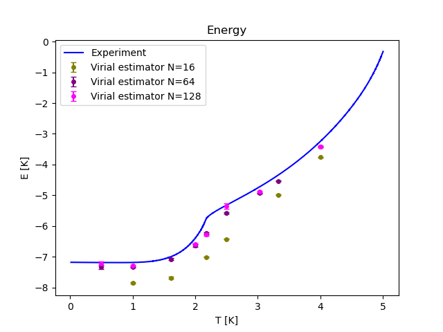
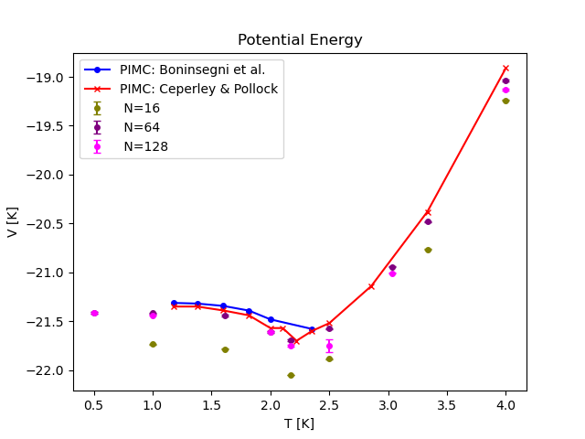
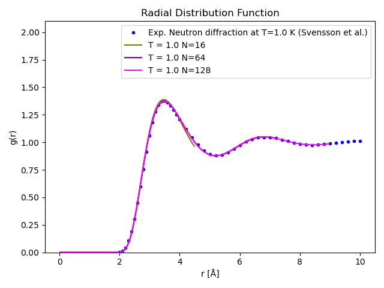
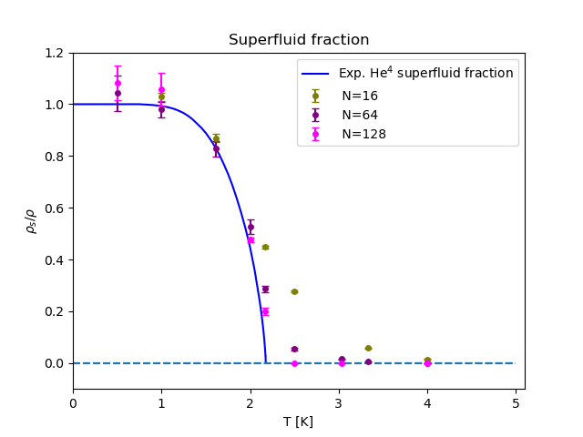
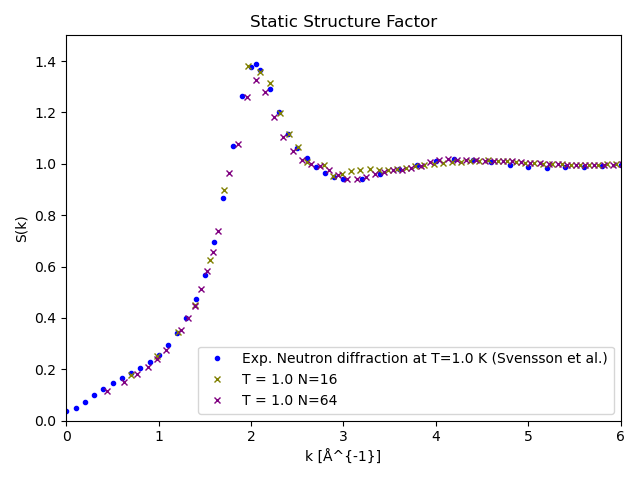

# PIMC: Path Integral Monte Carlo Programs

This directory contains a Julia PIMC program and a few Python programs mostly for plotting and demonstrations.

A new version a lot faster than previous one

# Main Program
- `PIMC_main.jl` is the main program for PIMC in the canonical ensemble. 
 - Reads in the temperature as a command line parameter, for example\
   `julia PIMC_main.jl T=1.0`
   start a PIMC simulation at T=1 (units depend on the system, usually K)
# Modules
- `PIMC_Common.jl`
  - A few sets of parameters for the three test systems in the book 
     - `case = 1`    Harmonic oscillator in 1D, N=2
     - `case = 216`  Liquid He4, N=16
     - `case = 264`  Liquid He4, N=64
     - `case = 2128` Liquid He4, N=128
     - `case = 2256` Liquid He4, N=256 (pretty slow)
     - `case = 3`    Noninteracting Bose fluid in 3D, N=256
 - `PIMC_Systems` potential and other functions for test systems mentioned above
 - `PIMC_Moves.jl` PIMC moves (updates): bisection, worm etc.
 - `PIMC_Structs.jl` most Julia structs and PIMC initialization (some already in `PIMC_main.jl`)
 - `PIMC_Measurements.jl` measurements done during PIMC simulation; what and how often is set in `PIMC_main.jl`
 - `PIMC_Reports.jl` what to print on screen or to the results HFD5 output file
 - `PIMC_Chin_Action.jl` Chin action (and `PIMC_Primitive_Action.jl` for primitive action), with specific energy estimators
 - `PIMC_Action_Interface.jl` common interface to choosing between actions
 - `PIMC_Utilities.jl` short utility programs
 - `QMC_Statistics.jl` functions to collect samples and block data for error estimation (same as in DMC)
  
Some results for liquid He4:

